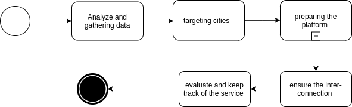
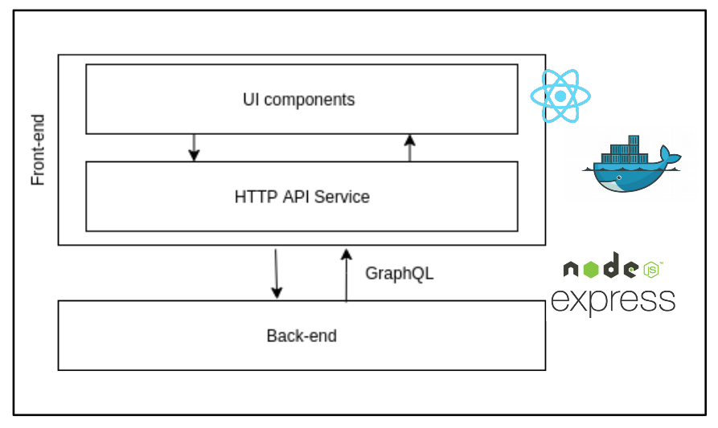
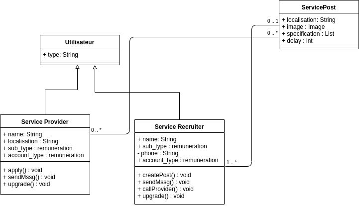
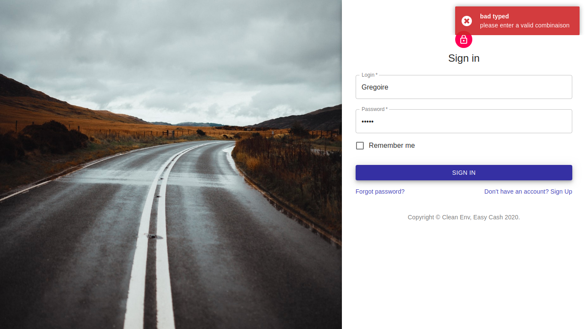
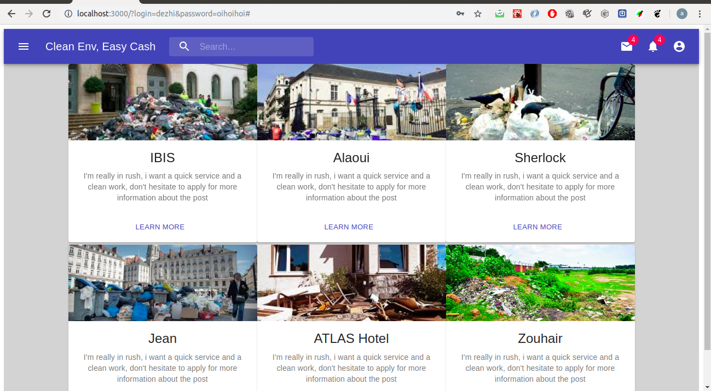
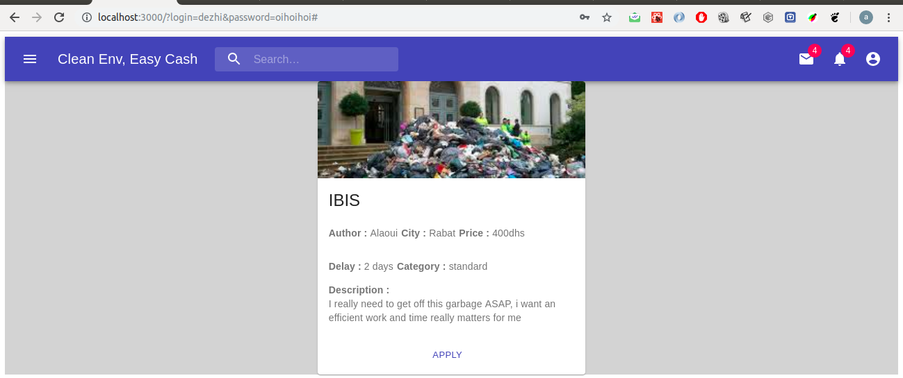
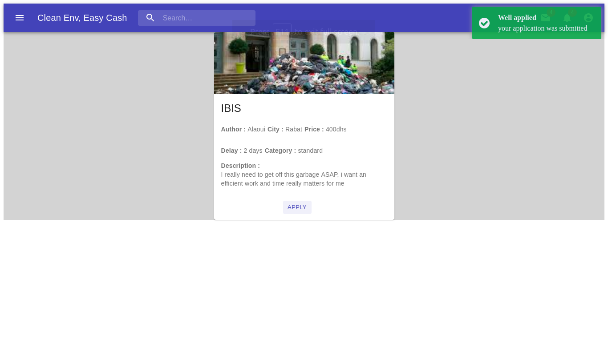
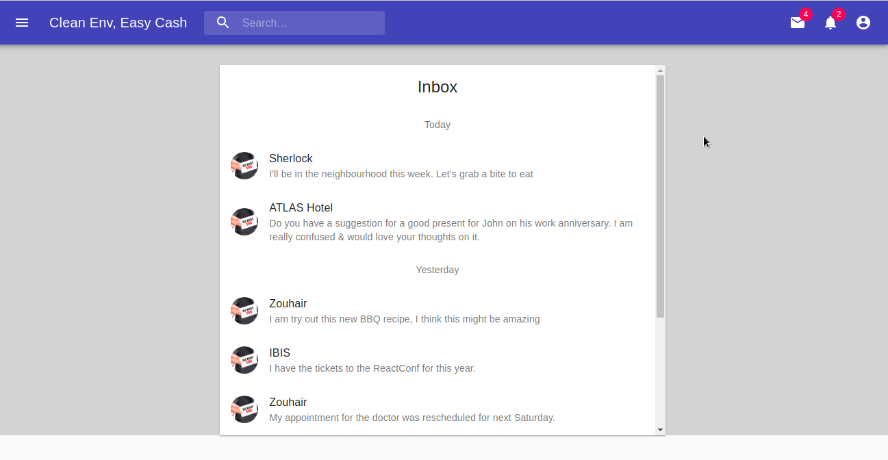
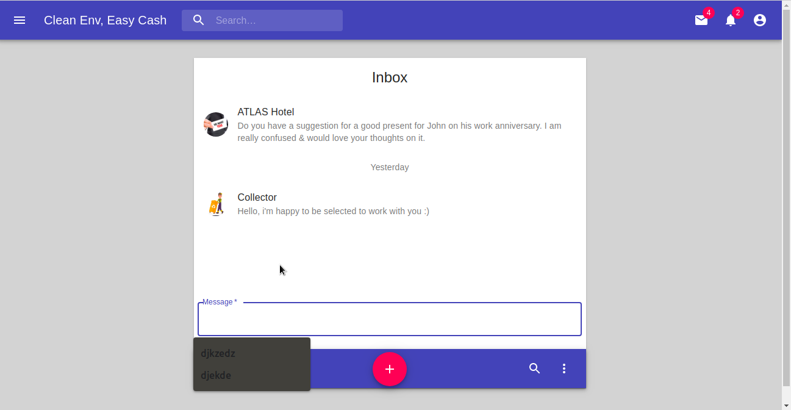

### About : 
It's about creating an OTOBOS application to link the two principal actors for a clean environment by offering an easy cash for the first actor and a clean place for the another actor, is it ambiguous :) well ... it's about the creation of a cleanTech application which provides reporting any kinda garbage in a specific area, in front of a Hotel, an entreprise or an important place to get it off by what we call "Service Provider" who can be an individual worker or an independent entreprise.
### Innovation Process Diagram : 

### Technical Architecture :

### Classes Diagram : 

### Set up the environment : 
Open the terminal and type : `` npm install ``

### To Start the app : 
***Start the Back-end*** :
Go to _back-end_ directory and type : ``node app.js`` to run the server on the port 1029

***Start the front-end*** : 
Go to _front-end_ directory and type : `` nodemon ``

### Some Interfaces :
- LoginIn :

The image in the left side is generated automatically everytime we reload the page.

- Wrong SignIn process : 

- The available posts/jobs (after a successful sign-in process) : 

- View a post details by clicking on it : 

- Applying to a job : 

- Collector - Global Room : 

To access to this, just click the chat icon on the top right.
It contains the chat with all recruiters, he can go to the ChatRoom with a specific recruiter by selecting him and this is by clicking on his message

- Collector - ChatRoom : 

For example in this case, the recruiter "ATLAS Hotel" room chat is selected.

_This will be updated periodically_