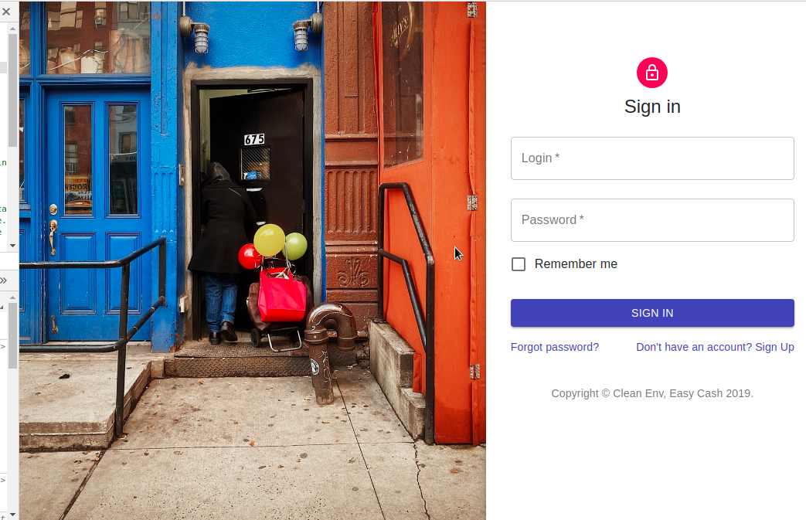
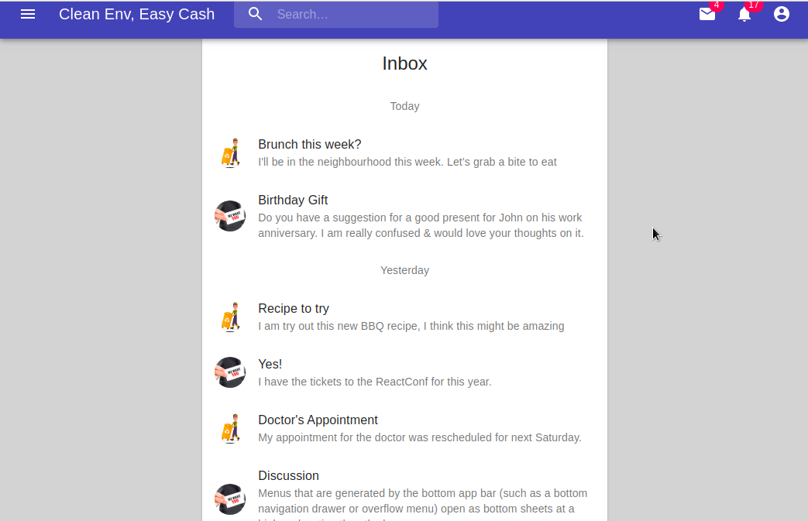
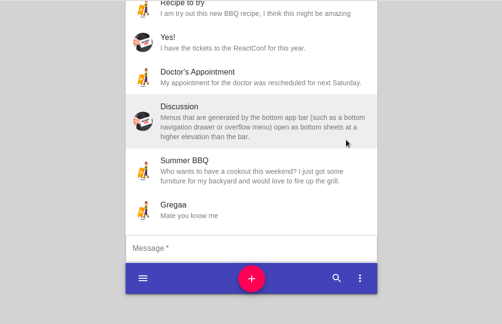

### About : 
It's about creating an OTOBOS application to link the two principal actors for a clean environment by offering an easy cash for the first actor and a clean place for the another actor, is it ambiguous :) well ... it's about the creation of a cleanTech application which provides to people to report any garbage in their area, in front of a Hotel, an entreprise or an important place and this to get it off by what we call "Service Provider" who can be ..
### Project Innovation Process :

### Set up the environment : 
Open the terminal and type : `` npm install ``

### To Start the app : 
***Start the Back-end*** :
Go to _back-end_ directory and type : ``node app.js`` to run the server on the port 1029

***Start the front-end*** : 
Go to _front-end_ directory and type : `` nodemon ``

### Some Interfaces :
- LoginIn (Model1) :

- LoginIn (Model2) : 

- Collector - Chat Room : 

_This will be updated periodically_